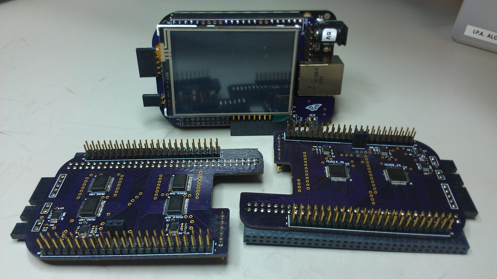
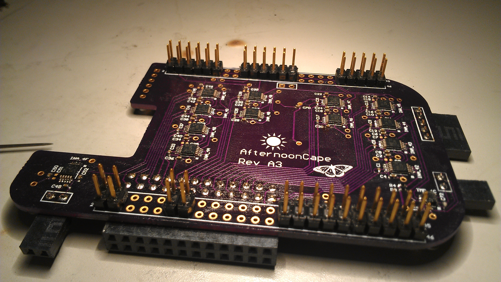
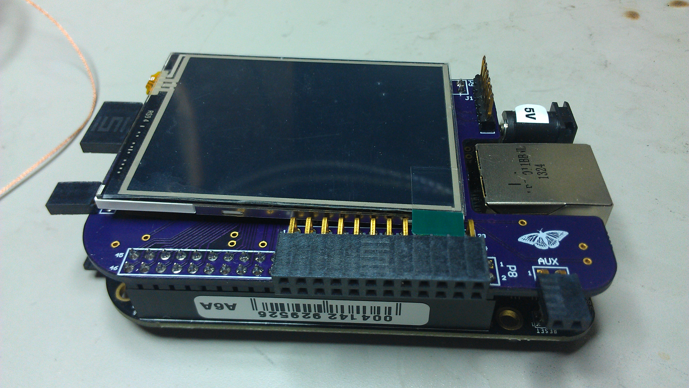
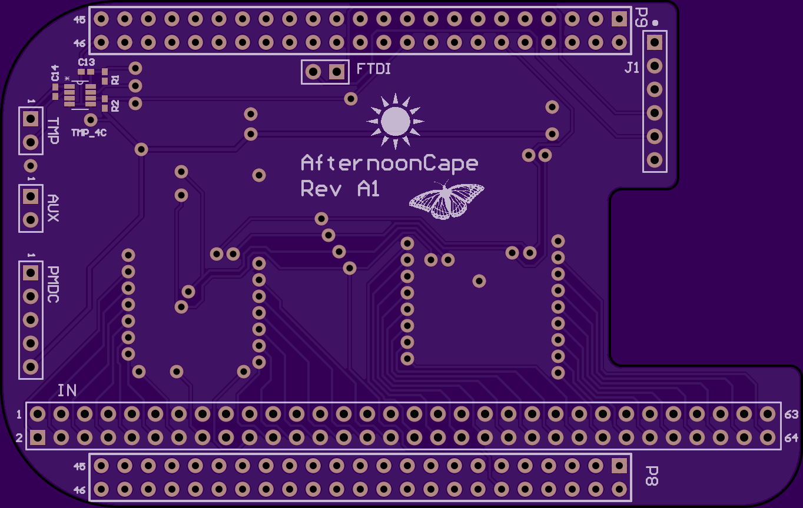
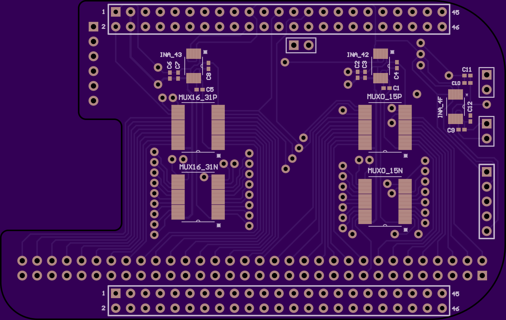
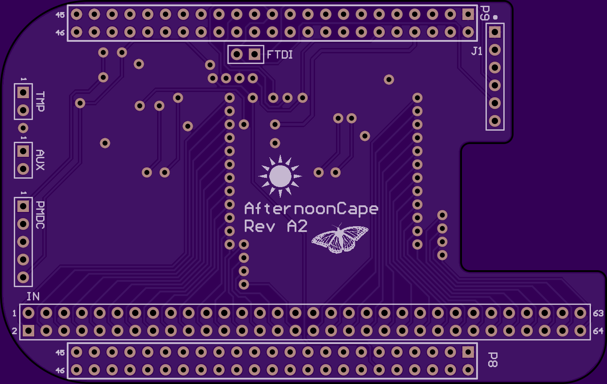
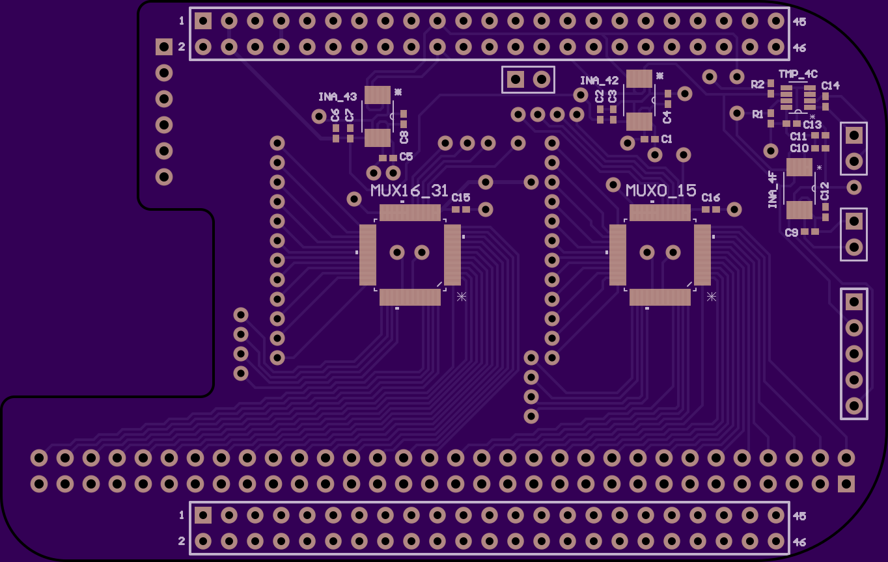
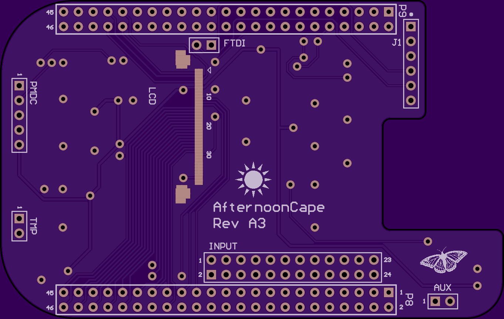
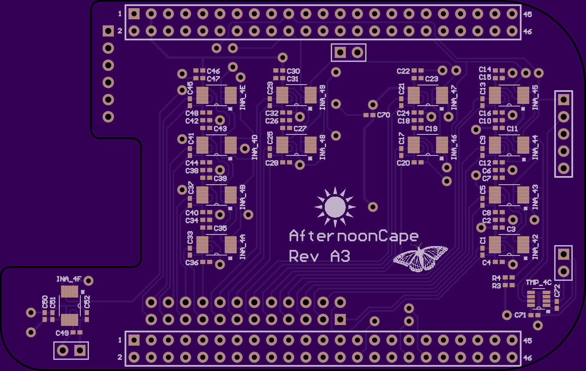

# afternoon-cape

## Overview
A Power Monitor (PM aka "Afternoon") cape for the BeagleBone Black. The AfternoonCape utilizes the INA226 instrumentation amplifier to accurately sample and monitor voltage, current, and power consumption of a given supply.

This repository contains:
- Altium library, schematic, and board files
- PCB gerbers and drill files
- Bill of materials
- Linux device driver for CD74HC4067, INA226, TMP441
- GUI source

## Hardware

Revision History:
- Alpha releases A1 (TI mux), A2 (ADI mux), A3 (discrete channel INAs)
- Beta releases B1 (TI mux)

### Rev. A1:

- MUX_SEL0 (P8, pin 12) - GPIO1_12 (0x44e10830, 0x30 offset, #44)
- MUX_SEL1 (P9, pin 23) - GPIO1_17 (0x44e10844, 0x44 offset, #49)
- MUX_SEL2 (P9, pin 27) - GPIO3_19 (0x44e109a4, 0x1a4 offset, #115)
- MUX_SEL3 (P9, pin 12) - GPIO1_28 (0x44e10878, 0x78 offset, #60)
- INA_42 handles channels 0 through 15
- INA_43 handles channels 16 through 31
- Accuracy +/- %
- list differences between revisions

### Rev. A2:

- MUX_SEL0 (P8, pin 12)
- MUX_SEL1 (P9, pin 23)
- MUX_SEL2 (P9, pin 27)
- MUX_SEL3 (P9, pin 12)
- INA_42 handles channels 0 through 15
- INA_43 handles channels 16 through 31
- Accuracy +/- %

### Rev. A3:

- INA42-INA4F handles channels 0 through 11
- Accuracy +/- %

### Rev. B1:

* Smaller vias
* Decoupling caps
* 16-channel? With LCD?
* 

## Software

Usage:
- loadmod afternoon-cape.ko EVM=am437xGP.txt
- Bash shell scripts using sysfs GPIO
- PMDC I2C protocol
- link to scripts

### Accuracy
The afternoon-cape is a good, low-cost solution for getting "ballpark" power measurements. It works best in medium power use cases, where the current shunt voltage is >1mV; voltages on the micro-volt level are less accurately interpreted through the analog mux.
Some tests were done on the AM335x GP EVM to determine accuracy. Compared with a $1000 Keithley Digital Multimeter with a $500 switching multiplexer module, the accuracy was comparable.
* Table comparison

## To Do:
* Complete design for Rev. B, assemble & test
* Ensure script compatibily with latest v3.14 kernel
* Cost comparison with other *more expensive* solutions (DARA, ACME, PMDC, Spectrum Digital)
* Qt GUI over network connection to a host PC
