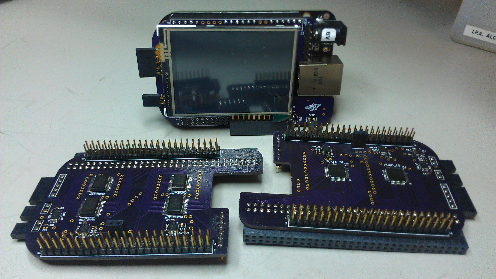
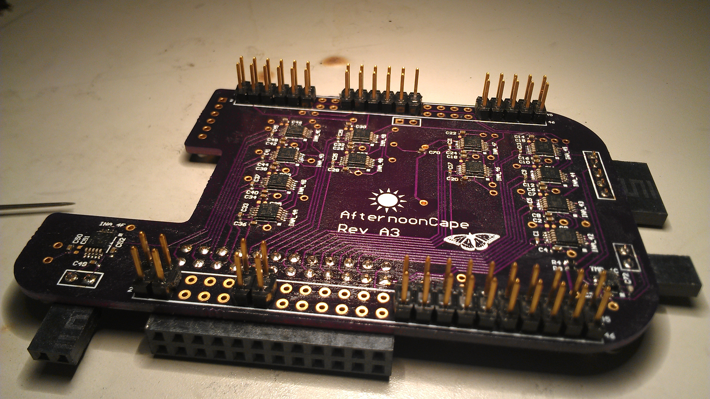
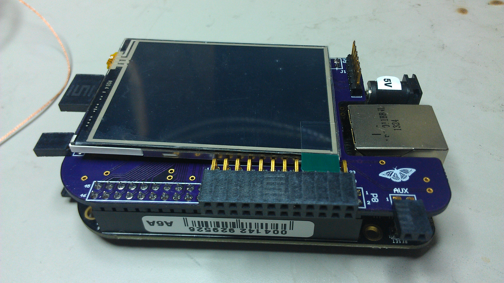
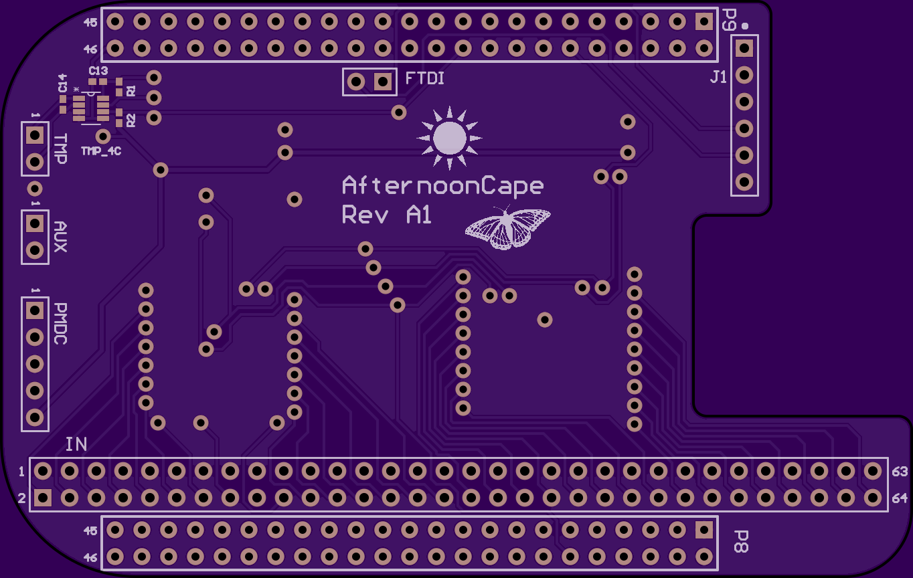
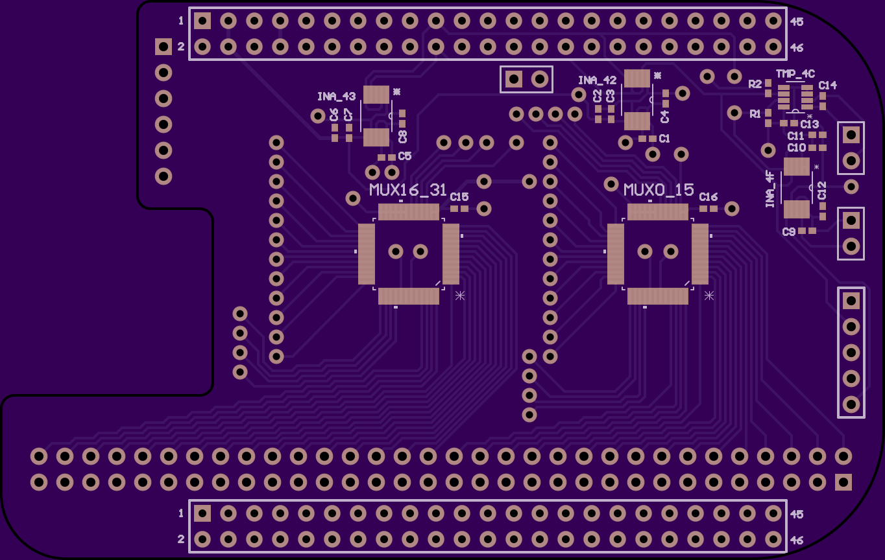

## Overview
The AfternoonCape is a low-cost power monitoring (PM aka "Afternoon") cape for the BeagleBone Black. It utilizes the INA226 instrumentation amplifier to accurately sample and monitor voltage, current, and power consumption of a given supply. This cape was created because of a need to quickly measure the active/leakage power of TI Sitara processors--without the use of a hefty digital multimeter. This solution is portable, relatively low-cost (~$20), and has an acceptable accuracy and sampling rate for my characterization purposes.

This repository contains:
- Altium libraries, schematics, and board files
- PCB gerbers and drill files
- Bill of materials
- Standalone Bash scripts, Linux device drivers for CD74HC4067, INA226, TMP441
- GUI source, log files

## Hardware
A few different board revisions were designed to test the accuracy of different signal path implementations. The "Alpha" revisions 





### Measuring Power
Please see this Current Shunt Monitoring app note for a great explanation of measuring power with instrumentation amplifiers.


### Rev. A1:
This revision utilizes a TI analog multiplexer
Added complexity with GPIOs




- MUX_SEL0 (P8, pin 12) - GPIO1_12 (0x44e10830, 0x30 offset, #44)
- MUX_SEL1 (P9, pin 23) - GPIO1_17 (0x44e10844, 0x44 offset, #49)
- MUX_SEL2 (P9, pin 27) - GPIO3_19 (0x44e109a4, 0x1a4 offset, #115)
- MUX_SEL3 (P9, pin 12) - GPIO1_28 (0x44e10878, 0x78 offset, #60)
- INA_42 handles channels 0 through 15
- INA_43 handles channels 16 through 31
- Accuracy +/- %
- list differences between revisions


### Rev. A2:
This revision utilizes an ADI analog multiplexer
High cost




- MUX_SEL0 (P8, pin 12)
- MUX_SEL1 (P9, pin 23)
- MUX_SEL2 (P9, pin 27)
- MUX_SEL3 (P9, pin 12)
- INA_42 handles channels 0 through 15
- INA_43 handles channels 16 through 31
- Accuracy +/- %


### Rev. A3:
This revision utilizes discrete INAs for each channel
Very high cost


- INA42-INA4F handles channels 0 through 11
- Accuracy +/- %


### Rev. B1:
After testing all three Alpha revisions, it was determined that the TI analog mux (Rev. A1) was sufficiently accurate


* Smaller vias
* Decoupling caps
* 16-channel? With LCD?
* 

## Software

### Standalone Bash Script
The standalone Bash script is the quick way to generate power numbers in a single instance. The script can be executed in a shell terminal on the BeagleBone Black running an Arago distribution. The following is a high-level procedure for taking power measurements with the AfternoonCape:
1. Initialize INA226, GPIOs
2. Take shunt and bus voltage measurements for all supplies
3. Average the measurement values and store
4. Calculate power
5. Output to console and/or log file
6. Cleanup

```bash
...
#EVM Specific
declare -a SUPPLIES=('VDD_CORE' 'VDD_MPU' 'VDDS_DDR' 'V1_8D' 'V3_3D' 'VDDS_DDR_M
EM');
declare -a RES=(0.05 0.05 0.05 0.1 0.1 0.05);
...
echo $mux_sel0 > /sys/class/gpio/gpio44/value
echo $mux_sel1 > /sys/class/gpio/gpio49/value
echo $mux_sel2 > /sys/class/gpio/gpio115/value
echo $mux_sel3 > /sys/class/gpio/gpio60/value
...
#Collect shunt voltage measurement
shuntv=$(i2cget -y 1 $MUX1_INA_ADDR $SHUNTV_REG w)
let "temp = $shuntv >> 8"
let "temp2 = $shuntv << 8 | $temp"
let "shuntv = $temp2 & 0xffff"
shuntv=$(echo "$shuntv*0.0025" | bc)
MUX1_SHUNTV[j]=$shuntv
...
#Collect bus voltage measurement
busv=$(i2cget -y 1 $MUX1_INA_ADDR $BUSV_REG w)
let "temp = $busv >> 8"
let "temp2 = $busv << 8 | $temp"
let "busv = $temp2 & 0xffff"
busv=$(echo "$busv*0.00125" | bc)
MUX1_BUSV[k]=$busv
...
#Calculate power
SUPPLIES_CURRENT[i]=$(echo "${SUPPLIES_SHUNTV[i]}/${RES[i]}" | bc -l)
SUPPLIES_POWER[i]=$(echo "${SUPPLIES_CURRENT[i]}*${SUPPLIES_BUSV[i]}" |
total_power=$(echo "$total_power+${SUPPLIES_POWER[$x]}" | bc)
```

Usage:
- loadmod afternoon-cape.ko EVM=am437xGP.txt
- Bash shell scripts using sysfs GPIO
- PMDC I2C protocol
- link to scripts

### Accuracy
The afternoon-cape is a good, low-cost solution for getting "ballpark" power measurements. It works best in medium power use cases, where the current shunt voltage is >1mV; voltages on the micro-volt level are less accurately interpreted through the analog mux.
Some tests were done on the AM335x GP EVM to determine accuracy. Compared with a $1000 Keithley Digital Multimeter with a $500 switching multiplexer module, the accuracy was comparable.
* Table comparison

## To Do:
* Complete design for Rev. B, assemble & test
* Ensure script compatibily with latest v3.14 kernel
* Cost comparison with other *more expensive* solutions (DARA, ACME, PMDC, Spectrum Digital, Tick)
* Qt GUI and data logging over a network connection to a host PC


https://skfb.ly/BQyC
<iframe width="640" height="480" src="https://sketchfab.com/models/9cae54c9355e4450bdcc2323d913253a/embed" frameborder="0" allowfullscreen mozallowfullscreen="true" webkitallowfullscreen="true" onmousewheel=""></iframe>

<p style="font-size: 13px; font-weight: normal; margin: 5px; color: #4A4A4A;">
    <a href="https://sketchfab.com/models/9cae54c9355e4450bdcc2323d913253a?utm_source=oembed&utm_medium=embed&utm_campaign=9cae54c9355e4450bdcc2323d913253a" target="_blank" style="font-weight: bold; color: #1CAAD9;">Fork</a>
    by <a href="https://sketchfab.com/hieu?utm_source=oembed&utm_medium=embed&utm_campaign=9cae54c9355e4450bdcc2323d913253a" target="_blank" style="font-weight: bold; color: #1CAAD9;">hieu</a>
    on <a href="https://sketchfab.com?utm_source=oembed&utm_medium=embed&utm_campaign=9cae54c9355e4450bdcc2323d913253a" target="_blank" style="font-weight: bold; color: #1CAAD9;">Sketchfab</a>
</p>
